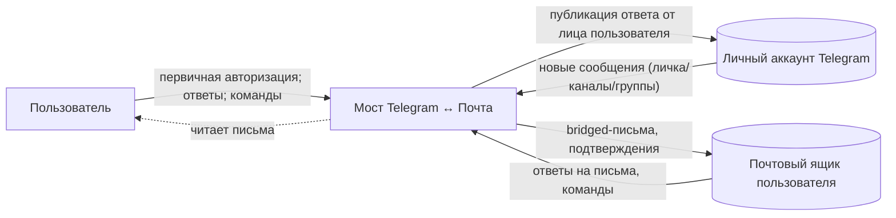

# Диаграмма окружения: Мост Telegram ↔ Почта

## Описание
Мост как чёрный ящик между личным аккаунтом Telegram пользователя и его почтовым ящиком. Внутрь
границы попадают гейтинг адресованности, батчинг диалога, формирование письма, приём ответов и
команд, публикация от лица пользователя, состояние и журнал связки. За границей — Telegram, почтовый
сервер и сам пользователь.

## Внешние системы и потребители
- Личный аккаунт Telegram пользователя — вход: новые сообщения личек, каналов, групп; выход:
  публикация ответа от лица пользователя. Доступ — на правах пользователя, не бота.
- Почтовый сервер пользователя (входящая и исходящая почта) — выход: bridged-письма и
  подтверждения на целевой ящик; вход: ответы на bridged-письма и команды управления.
- Пользователь — читатель писем и автор ответов/команд; при первом запуске проходит интерактивную
  авторизацию Telegram.

## Потоки данных и управления
- Входящий (Telegram → почта): мост опрашивает Telegram по расписанию, отбирает адресованное
  (личка целиком; каналы/группы — белый список или упоминание), группирует по диалогу за такт и
  отправляет одно письмо на диалог на целевой ящик; факт доставки фиксируется в журнале связки.
- Исходящий (почта → Telegram): мост опрашивает целевой ящик, ловит ответ на bridged-письмо,
  по журналу находит исходный диалог и публикует сообщение в Telegram от лица пользователя.
- Управляющий (почта → мост): письмо-команда с доверенного адреса включает/выключает доставку;
  мост отвечает подтверждением.
- Инициализация (пользователь → мост): однократная интерактивная авторизация порождает сессию,
  которую фоновый сервис далее использует неинтерактивно.

## Диаграмма

## Связи
- Паспорт: -> as-mailtg-bridge
