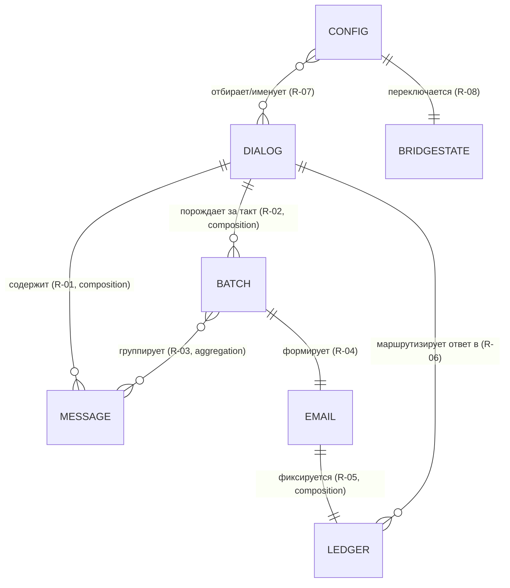

# Концептуальная модель данных: домен моста Telegram ↔ Почта

## Назначение
Описывает понятия, которыми оперирует мост при доставке сообщений Telegram письмом и возврате
ответа в Telegram: сообщение, диалог/источник, батч диалога, мостовое письмо, запись связки,
конфигурация и состояние моста. Служит основой функций доставки, гейтинга, маршрутизации ответа,
дедупа и управления. Для функций — -> fn-dm-batch-to-email, -> fn-channel-update-to-email,
-> fn-email-reply-to-tg, -> fn-media-in-email, -> fn-bridge-control-by-email.

## Сущности
- **Сообщение Telegram** — единичное входящее сообщение из личка, канала или группы.
- **Диалог / Источник** — устойчивый контейнер переписки: личный собеседник, канал, группа или
  топик группы; единица батчинга и ключ маршрутизации ответа.
- **Батч диалога** — упорядоченная группа адресованных сообщений одного диалога, накопленная за
  один такт сбора.
- **Мостовое письмо** — письмо, сформированное из батча одного диалога и отправленное на целевой
  ящик; тело — HTML с текстовым запасным вариантом.
- **Запись связки (ledger)** — связь мостового письма с диалогом Telegram для маршрутизации ответа
  и защиты от повторной доставки.
- **Конфигурация** — параметры развёртывания моста (доступы, ящик, белый список, политика
  упоминаний, порог вложений, периодичности, доверенные адреса команд).
- **Состояние моста** — единый переключатель доставки (включён/выключен), переживающий перезапуск.

## Атрибуты ключевых сущностей
**Сообщение Telegram:** идентификатор сообщения в рамках диалога; отправитель; момент времени;
текст; признак прямого упоминания пользователя; признак собственного эха (опубликовано мостом);
перечень вложений (изображения и прочие файлы, 0..N) с именем, размером, типом.

**Диалог / Источник:** идентификатор диалога; тип источника (личка / канал / группа / топик);
человекочитаемый тег источника; признак принадлежности белому списку; курсор прочитанного
(отметка «докуда прочитан диалог»).

**Батч диалога:** ссылка на диалог; отметка такта сбора; упорядоченный список включённых сообщений.

**Мостовое письмо:** идентификатор письма (устойчивый почтовый идентификатор); тег источника/диалога;
тело HTML и текстовый запасной вариант; встроенные изображения; приложенные файлы; текстовые
указания на крупные вложения (имя/размер/тип).

**Запись связки:** идентификатор мостового письма; идентификатор диалога; тип источника;
отправитель исходного сообщения; отметка доставки.

**Конфигурация:** доступ к аккаунту Telegram и путь к сессии; параметры входящей и исходящей почты;
целевой ящик; белый список источников; политика упоминаний (все / выбранные / форс по списку);
порог размера вложений; периодичность сбора; периодичность отправки; доверенные адреса команд;
опциональный секрет-токен команды.

**Состояние моста:** признак «доставка включена/выключена».

## Связи между сущностями
- **R-01** Диалог — Сообщение: composition («Сообщение вне Диалога в домене моста не существует»;
  удаление диалога из отслеживания снимает его сообщения).
- **R-02** Диалог — Батч диалога: composition («Батч не существует без своего Диалога и такта»).
- **R-03** Батч диалога — Сообщение: aggregation (батч группирует уже существующие сообщения
  диалога за такт; одно сообщение входит не более чем в один батч).
- **R-04** Батч диалога — Мостовое письмо: association 1:1 (один батч порождает ровно одно письмо).
- **R-05** Мостовое письмо — Запись связки: composition 1:1 («Запись связки не существует без
  своего письма»).
- **R-06** Запись связки — Диалог: association many:1 (много записей ссылаются на один диалог; ключ
  маршрутизации ответа — диалог, не отдельное сообщение).
- **R-07** Конфигурация — Диалог: association (белый список и теги конфигурации отбирают/именуют
  диалоги-источники).
- **R-08** Состояние моста — Конфигурация: association (состояние — отдельный переключатель поверх
  конфигурации; singleton).

## ER-диаграмма

## Ограничения и инварианты
- Каждое адресованное сообщение входит ровно в один батч своего диалога за такт.
- Курсор прочитанного диалога монотонно не убывает и продвигается только после успешной отправки
  письма (иначе перезапуск повторно соберёт недоставленные сообщения без дублей).
- На одно мостовое письмо приходится ровно одна запись связки; ключ связки — диалог, не сообщение.
- Ответ маршрутизируется в Telegram только при наличии записи связки для письма; ответ на письмо
  без записи связки игнорируется.
- Собственное эхо пользователя (сообщения, опубликованные мостом) не порождает нового мостового
  письма (анти-петля).
- Состояние моста — единственный экземпляр; при «выключено» входящая доставка и исходящая
  публикация приостановлены.

## Состояния и переходы

### Сообщение Telegram (жизненный цикл: fetched → gated → batched → delivered → replied)
Терминальные состояния: `dropped` (отсеяно/эхо) и `replied` (стабильно допускает повторную публикацию).

| Сущность | Состояние | Событие | → Результат (или ЗАПРЕЩЕНО, почему) | Момент перехода |
|---|---|---|---|---|
| Сообщение | (нет) | опрошено из Telegram после курсора | → fetched | при записи (такт сбора) |
| Сообщение | fetched | гейт: адресовано (личка / белый список / упоминание) | → gated-passed | при записи |
| Сообщение | fetched | гейт: не адресовано | → dropped (курсор двигается, письма нет) | при записи |
| Сообщение | fetched | распознано как собственное эхо пользователя | → dropped (анти-петля) | при записи |
| Сообщение | gated-passed | закрытие такта сбора для диалога | → batched (включено в батч диалога) | по расписанию (такт) |
| Сообщение | gated-passed / batched | перезапуск до отправки письма | → fetched (курсор не сдвинут, пересбор идемпотентен, дубля нет) | при чтении |
| Сообщение | batched | письмо диалога успешно отправлено на ящик | → delivered (создана запись связки, курсор продвинут) | при записи |
| Сообщение | batched | отправка письма не удалась | → gated-passed (курсор не продвигается, пересбор на след. такте) | при записи |
| Сообщение | delivered | получен ответ письмом на bridged-письмо диалога | → replied (публикация в диалог от лица пользователя) | при записи (опрос ящика) |
| Сообщение | delivered | повторный опрос / перезапуск | → delivered (дедуп по курсору+связке, без изменений) | при чтении |
| Сообщение | replied | повторный ответ письмом на тот же диалог | → replied (допускается доп. публикация; дедупа по содержанию ответа нет) | при записи |
| Сообщение | dropped | повторный опрос / перезапуск | ЗАПРЕЩЕНО повторно обрабатывать: терминал, курсор уже за сообщением | — |

### Состояние моста (включён ↔ выключен)
Singleton; переживает перезапуск.

| Сущность | Состояние | Событие | → Результат (или ЗАПРЕЩЕНО, почему) | Момент перехода |
|---|---|---|---|---|
| Состояние моста | включён | команда «выключить» с доверенного адреса | → выключен + подтверждение письмом | при записи |
| Состояние моста | включён | команда «включить» (уже включён) | → включён (подтверждение идемпотентно) | при записи |
| Состояние моста | включён | команда с недоверенного адреса | → включён (игнор + запись в лог) | при записи |
| Состояние моста | включён | наступил такт сбора/отправки | → включён (доставка и публикация идут) | по расписанию |
| Состояние моста | выключен | команда «включить» с доверенного адреса | → включён + подтверждение письмом | при записи |
| Состояние моста | выключен | команда «выключить» (уже выключен) | → выключен (подтверждение идемпотентно) | при записи |
| Состояние моста | выключен | команда с недоверенного адреса | → выключен (игнор + запись в лог) | при записи |
| Состояние моста | выключен | наступил такт сбора/отправки | → выключен (доставка и публикация приостановлены) | по расписанию |
| Состояние моста | включён / выключен | перезапуск сервиса | → сохранённое состояние (переживает рестарт) | при чтении |

## Связи
- Функции: -> fn-dm-batch-to-email, -> fn-channel-update-to-email, -> fn-email-reply-to-tg, -> fn-media-in-email, -> fn-bridge-control-by-email, -> fn-first-run-setup
