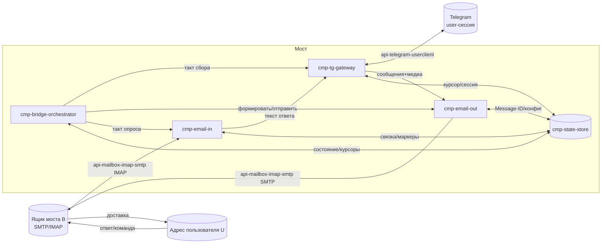

# Компонентная диаграмма: Мост Telegram ↔ Почта

## Описание
Пять логических компонентов моста и их связь с двумя внешними системами (Telegram — пользовательская
сессия; ящик моста B — SMTP/IMAP) и хранилищем состояния. Оркестратор ведёт такты; шлюз Telegram —
единственный владелец сессии (чтение и публикация); исходящая/входящая почта разнесены; хранилище держит
курсоры, журнал связки, маркеры и состояния.

## Связи между компонентами
- -> cmp-bridge-orchestrator командует тактами: вызывает -> cmp-tg-gateway (сбор/публикация),
  -> cmp-email-out (формирование/отправка), -> cmp-email-in (опрос ящика), читает/пишет -> cmp-state-store.
- -> cmp-tg-gateway ↔ Telegram (внешняя система) по -> api-telegram-userclient; отдаёт сообщения/медиа
  в -> cmp-email-out, принимает текст ответа от -> cmp-email-in для публикации.
- -> cmp-email-out → ящик B (SMTP) по -> api-mailbox-imap-smtp; читает конфигурацию/пишет Message-ID в -> cmp-state-store.
- -> cmp-email-in ← ящик B (IMAP) по -> api-mailbox-imap-smtp; ищет запись связки и ставит маркеры в -> cmp-state-store.
- -> cmp-state-store — общая память всех компонентов (курсоры, журнал связки, маркеры, состояния, конфигурация).

## Диаграмма

## Связи
- Компоненты: -> cmp-bridge-orchestrator, -> cmp-tg-gateway, -> cmp-email-out, -> cmp-email-in, -> cmp-state-store
