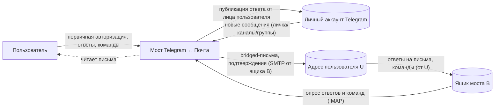

# Диаграмма окружения: Мост Telegram ↔ Почта

## Описание
Мост как чёрный ящик между личным аккаунтом Telegram пользователя и его почтой (ящик моста B и
адрес пользователя U). Внутрь
границы попадают гейтинг адресованности, батчинг диалога, формирование письма, приём ответов и
команд, публикация от лица пользователя, состояние и журнал связки. За границей — Telegram, почтовый
сервер и сам пользователь.

## Внешние системы и потребители
- Личный аккаунт Telegram пользователя — вход: новые сообщения личек, каналов, групп; выход:
  публикация ответа от лица пользователя. Доступ — на правах пользователя, не бота.
- Ящик моста (B) — выделенный почтовый аккаунт, которым владеет мост: с него уходят bridged-письма
  и подтверждения (SMTP), его же мост опрашивает на ответы и команды (IMAP).
- Адрес пользователя (U) — личный ящик пользователя: адрес назначения доставки и ожидаемый
  (доверенный) отправитель ответов и команд.
- Пользователь — читатель писем и автор ответов/команд; при первом запуске проходит интерактивную
  авторизацию Telegram.

## Потоки данных и управления
- Входящий (Telegram → почта): мост опрашивает Telegram по расписанию, отбирает адресованное
  (личка целиком; каналы/группы — белый список или упоминание), группирует по диалогу за такт и
  отправляет одно письмо на диалог с ящика моста B на адрес пользователя U; факт доставки фиксируется
  в журнале связки.
- Исходящий (почта → Telegram): мост опрашивает ящик моста B, ловит ответ с адреса пользователя U
  (и только от U) на bridged-письмо, по журналу находит исходный диалог и публикует сообщение в
  Telegram от лица пользователя.
- Управляющий (почта → мост): письмо-команда с адреса пользователя U, пришедшее на ящик моста B,
  включает/выключает доставку; мост отвечает подтверждением.
- Инициализация (пользователь → мост): однократная интерактивная авторизация порождает сессию,
  которую фоновый сервис далее использует неинтерактивно.

## Участки доставки (OE-DELIVERY, обратная ссылка)
Внешний путь каждой доставляющей функции до потребительского результата, в терминах этой диаграммы:
- Мост → ящик B (SMTP) → адрес U: -> fn-bridge-control-by-email/OE-DELIVERY (подтверждение вкл/выкл),
  -> fn-first-run-setup/OE-DELIVERY (уведомление «сессия недействительна»),
  -> fn-dm-batch-to-email/OE-DELIVERY (батч личных сообщений),
  -> fn-channel-update-to-email/OE-DELIVERY (батч канала/группы),
  -> fn-media-in-email/OE-DELIVERY (медиа как часть батча).
- Мост → Telegram (публикация от лица пользователя): -> fn-email-reply-to-tg/OE-DELIVERY.

## Диаграмма

## Связи
- Паспорт: -> as-mailtg-bridge
